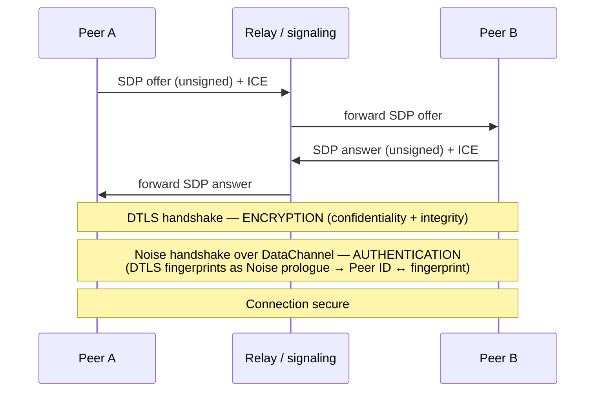
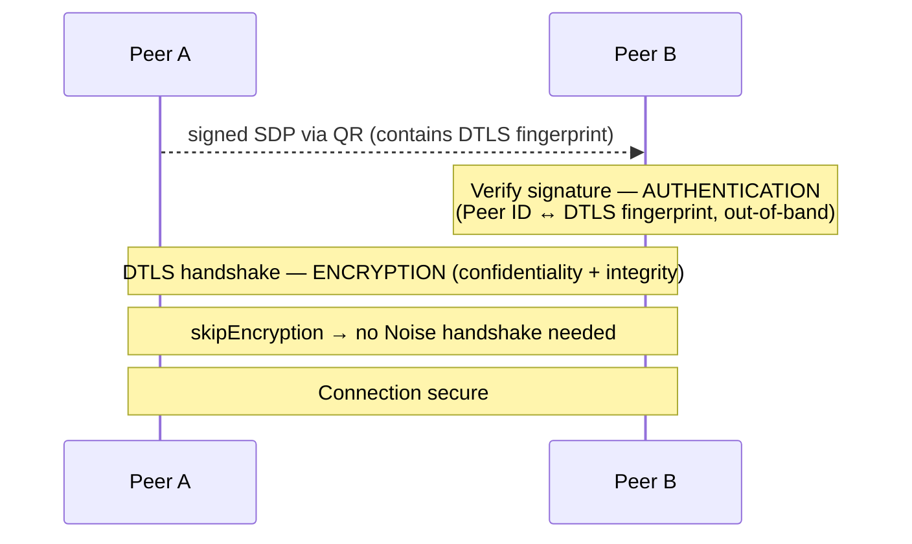

# Connection security: why `skipEncryption` is safe with signed SDP

> Scope: this document explains the security model of `@le-space/libp2p-webrtc-qr`.
> It covers *where encryption comes from*, *where authentication comes from*, and
> *why the Noise handshake can be skipped* (`skipEncryption`) when the SDP is signed.
> It is meant for contributors and security reviewers.

## TL;DR

A WebRTC connection needs **two independent guarantees**:

1. **Encryption** — confidentiality and integrity of the bytes on the wire.
2. **Authentication** — proof that the remote peer actually controls the private
   key behind its libp2p Peer ID, bound to *this specific* connection.

In WebRTC these are provided by **two different mechanisms**:

- **DTLS** always provides the encryption. This is part of the WebRTC stack itself
  and happens in every variant below.
- The **authentication** is what differs. Standard libp2p runs a **Noise handshake**
  for it. `webrtc-qr` instead gets it from a **signature over the SDP**.

`skipEncryption` does **not** turn off transport encryption — DTLS keeps encrypting.
It skips the redundant **Noise handshake**, because the signed SDP has already
established the Peer ID ↔ DTLS-fingerprint binding that Noise would otherwise produce.

This is only sound when the SDP is signed and the signature covers the DTLS
fingerprint. With **unsigned** SDP the binding is gone and you **must** run Noise.

---

## Background: encryption ≠ authentication

The two guarantees are easy to conflate because both are colloquially called
"security," but they answer different questions:

| Guarantee | Question it answers | Failure if missing |
|-----------|---------------------|--------------------|
| Encryption | *Can an eavesdropper read or tamper with the traffic?* | Passive/active on-path attacker reads or modifies data |
| Authentication | *Am I talking to the peer I think I am?* | Man-in-the-middle terminates the "secure" channel and impersonates the peer |

DTLS on its own gives you the first but not the second. The libp2p WebRTC Direct
spec states this directly: after a successful DTLS handshake the connection has
confidentiality and integrity **but not authenticity**, and authenticity is
guaranteed only by the Noise handshake that follows. See
[webrtc-direct.md → Connection Security][spec-webrtc-direct].

## How standard libp2p WebRTC does it

In standard `@libp2p/webrtc`, the flow is:

1. Peers exchange SDP + ICE candidates (via a circuit relay for browser-to-browser,
   or by encoding fingerprints into the multiaddr for browser-to-server).
2. **DTLS handshake** → encrypted channel (confidentiality + integrity).
3. **Noise handshake over the DataChannel** → authentication.

The important detail: in WebRTC, **Noise is used for authentication, not for
encryption**. The libp2p blog describes it precisely — the Noise handshake is
initiated by one side using the **DTLS fingerprints from the SDP as the Noise
prologue**, and completed by the other side over the data channel; this
authenticates both peers, while Noise itself does not encrypt the data (DTLS
already does). See [WebRTC in libp2p (blog)][blog-webrtc].

Feeding the DTLS fingerprints into the Noise prologue is what **binds the Peer ID
to the DTLS session**: a man-in-the-middle who terminated DTLS separately would
present a different fingerprint, and the prologue check would fail. During the
Noise handshake the static DH key is itself authenticated with the libp2p identity
keypair — see the [Noise spec → Static Key Authentication][spec-noise].



## How WebRTC Direct does it (for comparison)

WebRTC Direct removes the separate signaling exchange: the server's DTLS
certificate hash (`certhash`) is encoded **directly into the multiaddr**, alongside
the Peer ID:

```
/ip4/192.0.2.0/udp/12345/webrtc-direct/certhash/<hash>/p2p/<peer-id>
```

Because the dialer obtains this multiaddr through a trusted/out-of-band channel,
the `certhash` pins the exact certificate the server must present in DTLS, and the
`/p2p/<peer-id>` component ties that certificate to the Peer ID **before** the DTLS
handshake even runs. See [libp2p WebRTC docs][docs-webrtc] and
[webrtc-direct.md][spec-webrtc-direct].

`webrtc-qr` uses the **same idea**, but transports the binding via a signature
instead of via the multiaddr.

## How `webrtc-qr` does it (signed SDP)

Here the SDP is exchanged out-of-band (e.g. via a QR code) and is **signed** with
the peer's libp2p key. The SDP contains the DTLS fingerprint. The flow becomes:

1. Exchange **signed** SDP via QR. The SDP carries the DTLS fingerprint.
2. **Verify the signature** → authentication happens *here*, out-of-band.
3. **DTLS handshake** → encryption.
4. `skipEncryption`: no Noise handshake is run.



### Why signing replaces the Noise handshake

Strictly, signing does **not** replace *encryption* — DTLS still encrypts. It
replaces the *authentication* that Noise normally provides. The chain of reasoning:

```
SDP is signed
  → the signature covers the DTLS fingerprint inside the SDP
    → a valid signature proves: "Peer X (by Peer ID) commits to exactly this DTLS certificate"
      → the DTLS session established with that fingerprint is therefore bound to Peer X
```

This is **the same binding** that:

- the Noise prologue produces in standard WebRTC (fingerprint → Peer ID), and
- `certhash` produces in WebRTC Direct (fingerprint → Peer ID via the multiaddr).

Since authentication is already complete *before* DTLS, the Noise handshake would
only re-establish a binding you already have. It is redundant, so `skipEncryption`
drops it.

### The critical invariant

> **The signature MUST cover the DTLS fingerprint contained in the SDP.**

This is the load-bearing assumption of the whole design. If the signature covers
only part of the SDP (e.g. session identifiers or ICE parameters) but **not** the
`a=fingerprint:` line, an attacker can re-assemble a valid-looking SDP with their
own DTLS certificate, and the Peer ID ↔ fingerprint binding is broken while the
signature still verifies.

**How this implementation satisfies it.** `canonicalPayload` in
[`src/signaling.js`](../packages/webrtc-qr/src/signaling.js) signs these fields
and nothing else:

```
version, type, sessionId, peerId, offerPeerId, notBefore, notAfter, sdp
```

`sdp` is the complete session description as a string, so the `a=fingerprint:`
line is inside the signed bytes by construction rather than by a rule somebody
has to remember. Anything outside that list is dropped before verification, so a
payload cannot smuggle in fields the signature never covered.

The invariant therefore holds as long as `sdp` stays whole in that list. **If
anyone ever narrows it** — to a candidate list, to a reconstructed subset, to a
compact binary encoding — the fingerprint has to be carried into the signed bytes
explicitly, or `skipEncryption` stops being sound. That is the specific change to
watch for, and roadmap item 1 (QWBP-style compact payloads) is exactly the change
that would make it.

### When `skipEncryption` is NOT safe

`skipEncryption` relies entirely on the signature for authentication. Therefore:

- **Unsigned SDP** → no binding → you do **not** know who is on the other end.
  DTLS would still encrypt, but potentially to an impersonator. In this case you
  **must** run a normal Noise handshake and must **not** set `skipEncryption`.
- **Signature that does not cover the fingerprint** → see the invariant above;
  treat as unsigned.
- **Fingerprint not present in the SDP** → nothing to bind to; do not skip Noise.

Rule of thumb: `skipEncryption === true` is only permitted on a code path that has
already verified a signature over an SDP whose fingerprint it then enforces during
the DTLS handshake.

## Summary comparison

| | Encryption source | Authentication source | Peer ID ↔ fingerprint binding |
|---|---|---|---|
| Standard WebRTC | DTLS | Noise handshake (over DataChannel) | Noise prologue = DTLS fingerprints |
| WebRTC Direct | DTLS | `certhash` in multiaddr | multiaddr pins cert + Peer ID |
| `webrtc-qr` | DTLS | signature over SDP | signature covers DTLS fingerprint |

In all three, DTLS is the encryptor. The variants differ only in **how the DTLS
session gets bound to a Peer ID**.

## References

All links below were verified to resolve at the time of writing.

- libp2p WebRTC documentation — <https://libp2p.io/docs/webrtc/> [docs-webrtc]
- libp2p Noise documentation — <https://libp2p.io/docs/noise/>
- libp2p Secure Channels overview — <https://libp2p.io/docs/secure-channels-overview/>
- libp2p Security Considerations — <https://libp2p.io/docs/security-considerations/>
- WebRTC spec (browser-to-browser) — <https://github.com/libp2p/specs/blob/master/webrtc/webrtc.md>
- WebRTC Direct spec (browser-to-server) — <https://github.com/libp2p/specs/blob/master/webrtc/webrtc-direct.md> [spec-webrtc-direct]
- Noise spec (`noise-libp2p`) — <https://github.com/libp2p/specs/blob/master/noise/README.md> [spec-noise]
- "WebRTC in libp2p" blog (Noise-as-authentication, prologue detail) — <https://blog.libp2p.io/libp2p-webrtc-browser-to-server/> [blog-webrtc]
- `@libp2p/webrtc` package — <https://www.npmjs.com/package/@libp2p/webrtc>
- `@libp2p/webrtc` transport source — <https://github.com/libp2p/js-libp2p/tree/master/packages/transport-webrtc>
- `@chainsafe/libp2p-noise` (Noise implementation, `NoiseInit` config) — <https://github.com/ChainSafe/js-libp2p-noise>

[docs-webrtc]: https://libp2p.io/docs/webrtc/
[spec-webrtc-direct]: https://github.com/libp2p/specs/blob/master/webrtc/webrtc-direct.md
[spec-noise]: https://github.com/libp2p/specs/blob/master/noise/README.md
[blog-webrtc]: https://blog.libp2p.io/libp2p-webrtc-browser-to-server/
